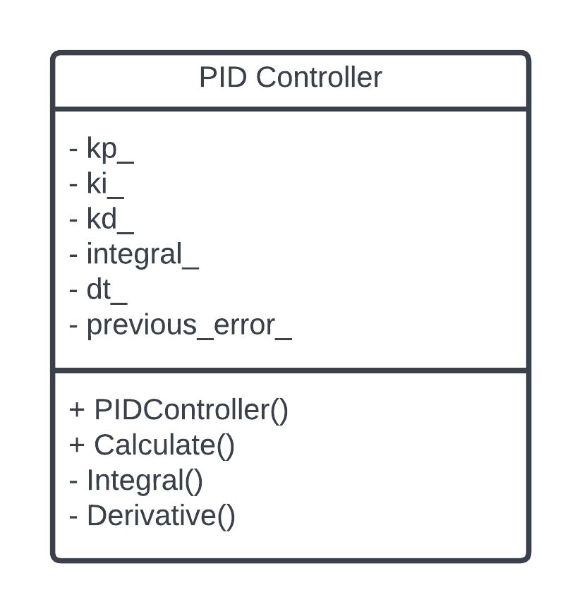
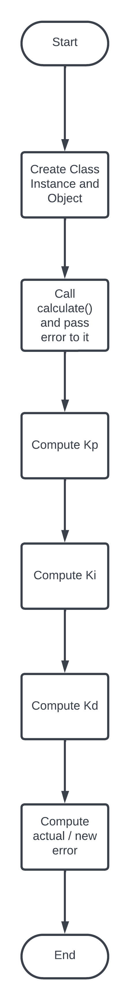

# cpp-boilerplate-v2

## C++ Boilerplate v2 Badges


[](https://codecov.io/gh/KshitijKarnawat/testdrivendevlopment)
[](LICENSE)

## Authors

### Part 1

Driver: Kshitij Karnawat [Github](github.com/KshitijKarnawat)

Navigator: Abhimanyu Saxena [Github](github.com/abhimanyu-saxena)

### Part 2

Solo Programmer:
Name - Lowell Lobo
GitHub User - lorocks

## Discussion Notes

1 - The unit tests had to be manually calculated and then compared with expected result

2 - EXPECT_DOUBLE_EQ did not work as intended thus EXPECT_NEAR had to be used

## UML Diagrams

### Class Diagram



### Activity Diagram



## Installation

```bash
# Clone the repository via HTTPS
git clone https://github.com/KshitijKarnawat/testdrivendevlopment.git

# Clone the repository via SSH
git clone git@github.com:KshitijKarnawat/testdrivendevlopment.git

cd testdrivendevlopment

mkdir build

cmake -D WANT_COVERAGE=ON -D CMAKE_BUILD_TYPE=Debug -S ./ -B build/

# For Code Coverage
cmake --build build/ --clean-first --target all test_coverage

# For Running Tests without Code Coverage
cd build; ctest; cd ..

```

## Dependencies

- cmake >= 3.11
  - All OSes: [click here for installation instructions](https://cmake.org/install/)
- gtest
  - Linux: Follow the instructions [here](https://www.eriksmistad.no/getting-started-with-google-test-on-ubuntu/)
  - Mac: `brew install gtest`
  - Windows: `vcpkg install gtest`
- doxygen
  - Linux: `sudo apt-get install doxygen`
  - Mac: `brew install doxygen`
  - Windows: `choco install doxygen.install`
